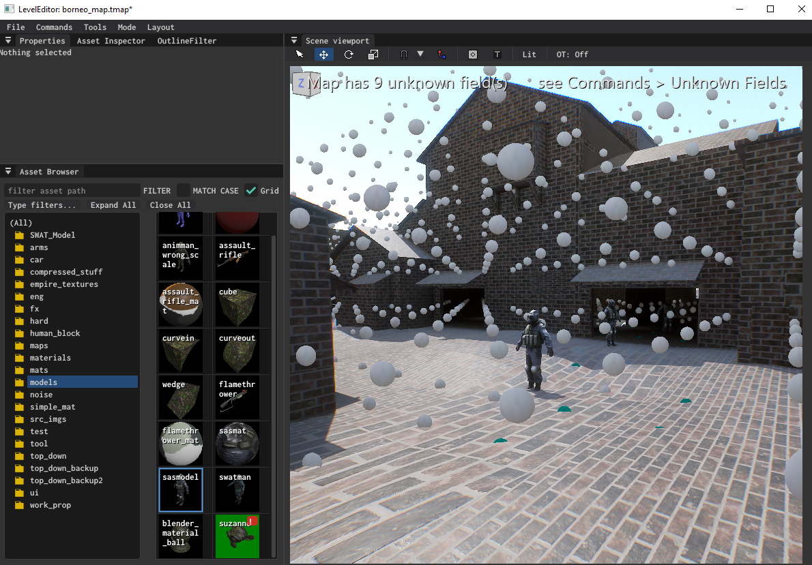

# Documentation

## Index 

- [[scripting/lua_cookbook|Lua Cookbook Examples]] — Examples/Overview of using Lua to write gameplay/editor code. Also useful for `cscli eval` commands.

- [[rendering/texture_pipeline]] — .tis/.dds/.png flow: compile, nearest_filtering, UI textures, inspector

- [[rendering/materials]] — `.mm` / `.mi` authoring + material system internals

- [[rendering/decals]] — decal materials, write flags, parallax occlusion mapping

- [[rendering/model_importing]] — `.glb` import, `.mis` settings, `.cmdl` paths

- [[ui/rmlui_agent_guide]] — RmlUi integration: RCSS vs CSS gotchas, data-binding attrs, Lua API, known v1 limitations

- [[physics/transforms]] — PhysicsBody transform ownership model (who drives whom), teleport_to/move_to vs set_transform, body types, Unity/Unreal name map, trigger rules & gotchas

- [[navigation]] — Recast/Detour navmesh system: components, baker, sidecar format, debug cvars

- [[scripting/vscode_debugger]] — attach VS Code (EmmyLuaDebugger) to a running build to step Lua scripts

## new documetnation pages:

### general documentation

### model importing
- manual
- asset inspector settings
- animations
	
### animation
- animation tree
- 	node types, summary of their paramters
- example map of testing nodes
- animation seq inspector
	
### editor page
- how to use
- asset browser etc

### materials
- material types
- parameters

### textures
- import settings
	
### tooling
- making new project
- Scripts/
- cscli.exe
- type check
- codegen script
- integration_test.ps1
- run_editor.ps1
- run_game.ps1
	
### sounds
- importing, compression types
- playing a sound
	
### console commands
	
### Rendering features
- rendering features.
- culling.
- ddgi.
- compact instances path

Entity lifecycle and Component types
	- meshcomponents,lightcomponents

testing

scripting

RMLUI